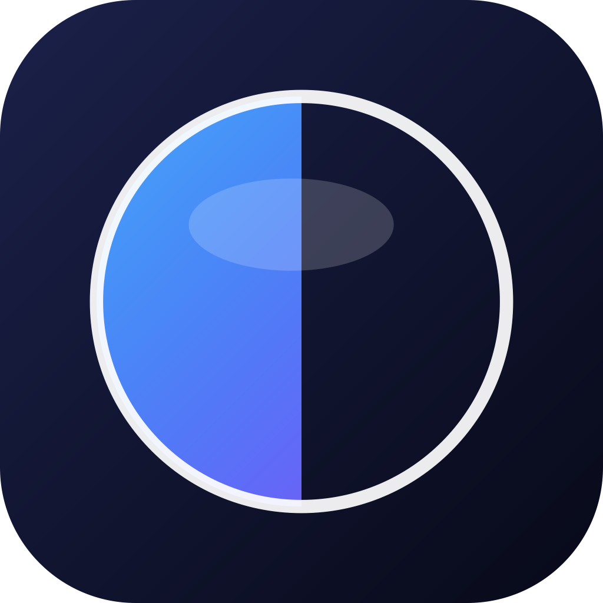

<div align="center">



# FocusLens

**Dim everything except your active window.**

A native macOS menu bar app that blurs every window except the one you're working in — so you can focus on one task at a time.

[](https://www.apple.com/macos/)
[](https://swift.org)
[](https://developer.apple.com/xcode/swiftui/)
[](LICENSE)
[](https://github.com/parththummar/FocusLens/releases)
[](https://github.com/parththummar/FocusLens/releases)
[](https://github.com/parththummar/FocusLens/stargazers)

[Download](#installation) · [Features](#features) · [Usage](#usage) · [Build from source](#build-from-source) · [Contributing](#contributing)

</div>

---

## Why

You have ten apps open. You only need one. FocusLens covers everything else with a soft frosted-glass dim — the active window stays crisp, the rest fades into background noise. Click through to the next window and the dim moves with you, smooth and animated. Shake your cursor to toggle. No new keybinding to learn, no app switcher to fight.

Inspired by [Monocle](https://iamdk.gumroad.com/l/monocle-elegant-macos-window-blur-focus). Rebuilt from scratch, **free and open source under MIT**.

## Features

### Two focus modes
- **Deep** — full-screen frosted-glass dim, heavy tint everywhere except your active window
- **Ambient** — subtle vertical-fade gradient, cinematic backdrop instead of full coverage

### Real visual control
- Variable blur radius **0–50** (continuous slider)
- Overlay opacity **10–100%**
- 9 Apple system colors + rainbow custom picker + **As System** (matches macOS accent color live)
- Optional gradient tint with second color + 0–360° angle
- **Edge glow** — soft halo around the focused window, like macOS Stage Manager (toggle + radius slider, color follows tint)
- **Custom backdrop** — replace the blur with your own image or the current macOS desktop wallpaper
- High-frequency film grain (2048×2048 noise, soft-light blend, Gaussian-distributed for cinematic feel)
- Grayscale background filter
- Animated shader modes: **Static / Breathing / Drift / Pulse** with speed slider
- 5-tick sensitivity slider for shake detection (Very Low → Very High)

### Smart window tracking
- **Active window floats above the overlay** — using private CGS APIs to raise the focused window's z-level, so there's zero corner seam or anti-alias bleed around rounded macOS windows
- **Pinned apps** — designate apps that always stay clear, even when not focused. Perfect for keeping a terminal, music player, or reference window visible while you work elsewhere
- Per-screen active window detection — focus Xcode on monitor 1 + Slack on monitor 2, both stay crystal clear
- Optional **highlight all windows of same app** for multi-window workflows (Xcode editors, Figma boards)
- Smooth animated cutout transitions when you switch windows
- AX-based focus tracking + `CGWindowList` z-order fallback
- Skips off-screen and minimized windows automatically

### Gestures & shortcuts
- **Shake to toggle** — wiggle the cursor in any direction (2D detection, 60 Hz polling, no Input Monitoring permission required)
- **Shake-to-peek** — hold ⇧/⌥/⌘ (configurable) + shake to temporarily reveal everything
- Three global hotkeys with full F1–F12 + number-row support: **toggle overlay**, **open settings**, **exclude current app**

### Rules
- Exclude any app from the overlay (file picker or running-app menu)
- **Finder excluded by default** on first run
- **Hide Dock** toggle — overlay leaves the Dock area uncovered when off; hides the Dock entirely when on
- **Hide Menu Bar** toggle — same behavior for the menu bar strip
- Drag-and-drop awareness — overlay fades out while you drag a file, fades back when you drop

### Native macOS feel
- Menu bar agent (no Dock icon)
- Control Center–style Settings UI built in SwiftUI (sidebar nav, material-backed cards, segmented mode picker)
- Custom app icon (depth-tunnel concentric focus rings) + 4-state menu bar glyph
- URL scheme automation: `focuslens://toggle | enable | disable | settings`
- Multi-display aware, hot-swappable monitors
- Onboarding for Accessibility permission with auto-recovery polling
- ⌘W closes Settings, transparent titlebar, vibrant material background
- **iCloud sync** — optional toggle that mirrors your overlay configuration across all your Macs

## Installation

> **Note:** FocusLens is not yet code-signed with an Apple Developer ID. macOS Gatekeeper will warn on first launch. The steps below work around it. A signed/notarized build is on the roadmap.

### Homebrew (recommended)

```bash
brew tap parththummar/focuslens
brew install --cask focuslens
```

The cask strips the macOS quarantine attribute on install so Gatekeeper does not block launch (the build is currently unsigned). The tap is community-maintained at [parththummar/homebrew-focuslens](https://github.com/parththummar/homebrew-focuslens).

### Direct download

1. Grab `FocusLens.zip` from the [latest release](https://github.com/parththummar/FocusLens/releases/latest)
2. Unzip → drag `FocusLens.app` into `/Applications`
3. Strip the quarantine attribute (or `Right-click → Open` once):

```bash
xattr -dr com.apple.quarantine /Applications/FocusLens.app
```

4. Launch FocusLens
5. Grant **Accessibility** access when prompted (System Settings → Privacy & Security → Accessibility)

### Heads-up about unsigned builds

- After every new release, you may need to **remove + re-add FocusLens** in System Settings → Privacy & Security → Accessibility. macOS ties the permission to the app's code-signature hash, and unsigned builds change hash each time.
- Right-click → Open works as a one-time bypass if `xattr` feels intimidating.
- If Gatekeeper still blocks the app, open **System Settings → Privacy & Security**, scroll to the message about FocusLens, click **Open Anyway**.

## Updating

### Homebrew

```bash
brew update
brew upgrade --cask focuslens
```

After upgrading, if FocusLens stops detecting your active window:

1. Open **System Settings → Privacy & Security → Accessibility**
2. Select **FocusLens** in the list and click the **−** button to remove it
3. Click **+**, add `/Applications/FocusLens.app` again, and enable the toggle

This is needed because each unsigned build has a different code-signature hash. A signed release in the future will eliminate this step.

### Direct download

Download the newer zip from [Releases](https://github.com/parththummar/FocusLens/releases), drag the new `FocusLens.app` over the old one in `/Applications`, run `xattr -dr com.apple.quarantine /Applications/FocusLens.app`, then re-grant Accessibility as above.

## Uninstalling

### Homebrew

```bash
# Remove the app and its preferences (via the cask's zap stanza)
brew uninstall --cask --zap focuslens

# Drop the tap
brew untap parththummar/focuslens

# Purge Homebrew's download cache + old logs
brew cleanup --prune=all -s
```

Optional manual cleanup if you skipped `--zap`:

```bash
defaults delete com.parththummar.FocusLens 2>/dev/null
rm -rf ~/Library/Preferences/com.parththummar.FocusLens.plist \
       ~/Library/Application\ Support/FocusLens \
       ~/Library/Caches/com.parththummar.FocusLens \
       ~/Library/HTTPStorages/com.parththummar.FocusLens \
       ~/Library/Saved\ Application\ State/com.parththummar.FocusLens.savedState
```

Then remove the **FocusLens** row from **System Settings → Privacy & Security → Accessibility** so macOS forgets the old TCC grant.

### Direct download

```bash
# Move the app to Trash
rm -rf /Applications/FocusLens.app

# Remove saved settings + caches
defaults delete com.parththummar.FocusLens 2>/dev/null
rm -rf ~/Library/Preferences/com.parththummar.FocusLens.plist \
       ~/Library/Application\ Support/FocusLens \
       ~/Library/Caches/com.parththummar.FocusLens \
       ~/Library/HTTPStorages/com.parththummar.FocusLens \
       ~/Library/Saved\ Application\ State/com.parththummar.FocusLens.savedState
```

Then remove FocusLens from **System Settings → Privacy & Security → Accessibility**.

### Verify it's fully gone

```bash
ls /Applications | grep -i focus    # empty
brew list --cask | grep -i focus    # empty (Homebrew users)
brew tap | grep -i focus            # empty (Homebrew users)
```

## Usage

| Action | How |
|---|---|
| Toggle overlay | Click menu bar icon, or shake cursor, or your global hotkey |
| Peek through | Hold ⇧ + shake to reveal everything temporarily |
| Switch focus | Just click another window — the dim follows your focus |
| Exclude current app | Right-click menu bar icon → **Exclude Current App** |
| Open settings | Right-click menu bar icon → **Settings…** |
| Quit | Right-click menu bar icon → **Quit** |

### Menu bar icon states

| Icon | Meaning |
|---|---|
| ◯ (hollow ring) | Overlay off |
| ⬤ (solid filled, follows accent in template mode) | Deep mode active — solid disc with a small hollow center |
| Purple→blue→cyan gradient disc | Ambient mode active — renders in color, ignores template tinting |
| ◌ (dashed ring) | Current app excluded — overlay paused |

The icon is drawn programmatically at every render, so it always matches your macOS dark/light theme.

### Right-click menu

Each item carries an SF Symbol so the menu reads at a glance: ▶︎ enable, ⏸ disable, 🪟 currently focused app, ⊕/⊖ exclude/include current app, ⚙︎ settings, ⏻ quit.

### URL scheme

Drive FocusLens from Shortcuts, AppleScript, or a Terminal:

```bash
open "focuslens://toggle"
open "focuslens://enable"
open "focuslens://disable"
open "focuslens://settings"
```

## Permissions

FocusLens needs **Accessibility** access to detect which window you're focused on.

On first launch you'll see an onboarding window with a one-click button to **System Settings → Privacy & Security → Accessibility**. Flip the FocusLens switch on. The app polls every 1.5s and starts the moment you grant access — no restart needed. Once permission is granted for the first time, the Settings window opens automatically with a welcome banner explaining how to use FocusLens.

> **Heads up:** macOS ties Accessibility permission to the app's **code signature**. If you rebuild FocusLens from source the signature changes and the old permission entry no longer matches. Fix: remove FocusLens from the Accessibility list and add it again. Signed release builds don't have this problem.

## Build from source

### Requirements
- macOS 14.0+
- Xcode 15.0+
- [XcodeGen](https://github.com/yonaskolb/XcodeGen) (project file is generated, not committed)

### Steps

```bash
git clone https://github.com/parththummar/FocusLens.git
cd FocusLens
brew install xcodegen
xcodegen generate
open FocusLens.xcodeproj
```

Hit ⌘R in Xcode. Or from the command line:

```bash
xcodebuild -project FocusLens.xcodeproj -scheme FocusLens -configuration Release build
```

The built `.app` lands in `~/Library/Developer/Xcode/DerivedData/FocusLens-*/Build/Products/Release/`.

### Project layout

```
FocusLens/
├── App/             # App entry point, AppDelegate, status item
├── Core/            # WindowTracker, OverlayManager, ShakeDetector, HotkeyManager, AutomationHandler
├── Overlay/         # OverlayWindow, BlurOverlayView, CutoutView
├── Views/           # SettingsView, AppearanceSettings, GestureSettings, RulesSettings, OnboardingView
├── Models/          # Settings, ExcludedApp, TintPreset, OverlayMode, ShaderMode
└── Resources/       # Info.plist, entitlements, Assets.xcassets
```

No external dependencies — Apple frameworks only (AppKit, SwiftUI, CoreImage, Accessibility, Carbon hotkeys, ServiceManagement).

## Configuration

Settings live in `UserDefaults` under your standard suite. Reset everything with:

```bash
defaults delete com.parththummar.FocusLens
```

## Contributing

PRs welcome. Before opening one:

1. Open an issue describing the change
2. Keep changes focused — one feature or fix per PR
3. Match the existing code style (Swift API design guidelines, no force-unwraps in new code)
4. Verify the project builds with `xcodebuild` before pushing

## Roadmap

- [ ] Sparkle auto-updater
- [ ] Per-app overlay profiles (different blur/tint per excluded-or-included app)
- [ ] Custom Metal shader for true variable blur (free of `NSVisualEffectView` material constraints)
- [ ] Localization (PRs welcome)
- [ ] Apple Developer ID signing + notarization (drops the `xattr` step from install)
- [ ] Upstream submission to `Homebrew/homebrew-cask`

## FAQ

**Does this slow my Mac down?**
No. The overlay only redraws when the focused window changes. CPU stays under ~1% idle.

**Why is the menu bar dimmed?**
Toggle **Rules → Hide Menu Bar** off — the overlay will stop covering the menu bar strip.

**My cursor shake doesn't trigger the toggle.**
Drop **Sensitivity** in Settings → Gestures toward **Very High**, then try a brisk zigzag. Detection is 2D — any direction works.

**Can I use the system accent color as the tint?**
Yes — Settings → Appearance → Tint → tap **As System**. The overlay tint follows your macOS accent color, updating live.

**Does it work with multiple displays?**
Yes. Each display gets its own overlay and tracks its own active window. Focus an app on monitor 1 and a different app on monitor 2 — both stay clear, everything else blurs.

**The active window has a thin dark seam around the corners.**
You shouldn't see this any more — the active window is now raised above the overlay via a private CGS API, so the window itself sits on top instead of being cut out of the overlay. If you do see a seam, file an issue with the focused app's name.

**Where is the Quit button?**
Right-click the menu bar icon → **Quit**.

**Can I add my own shortcut for "exclude the current app"?**
Yes — Settings → Gestures → Global Shortcuts → record one for **Exclude Current App**.

**Why does Finder not get blurred?**
FocusLens excludes Finder by default so alt-tabbing to the desktop doesn't trigger the overlay. Remove it from Settings → Rules → Excluded Apps if you want Finder blurred too.

## License

[MIT](LICENSE) © Parth Thummar

Inspired by [Monocle](https://iamdk.gumroad.com/l/monocle-elegant-macos-window-blur-focus). Independent implementation. No code shared.

---

<div align="center">
If FocusLens helps you focus, drop a ⭐ on the repo.
</div>
